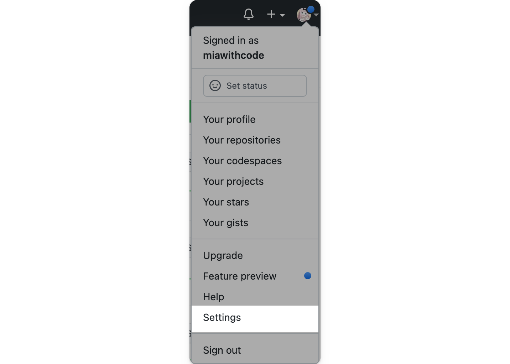
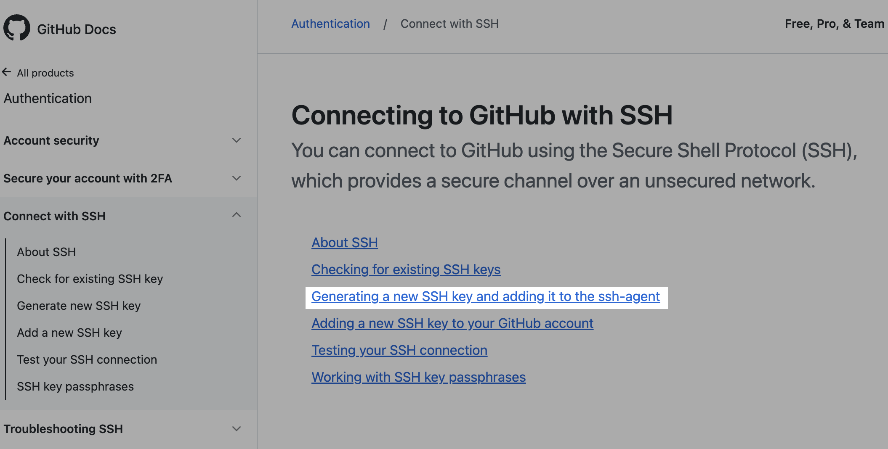
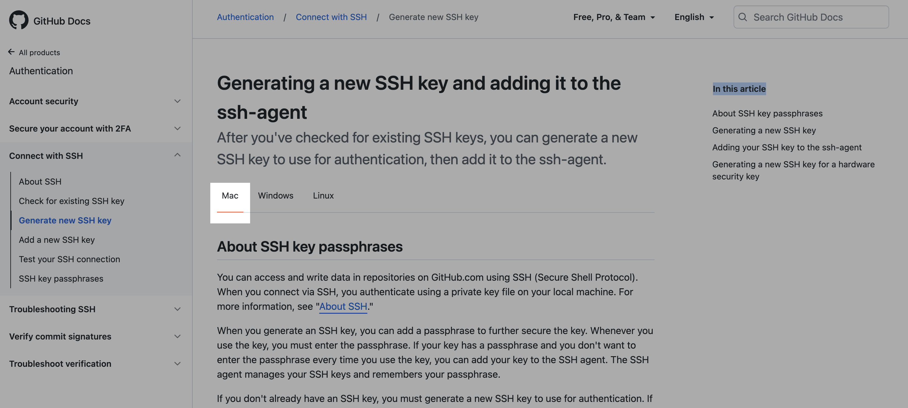
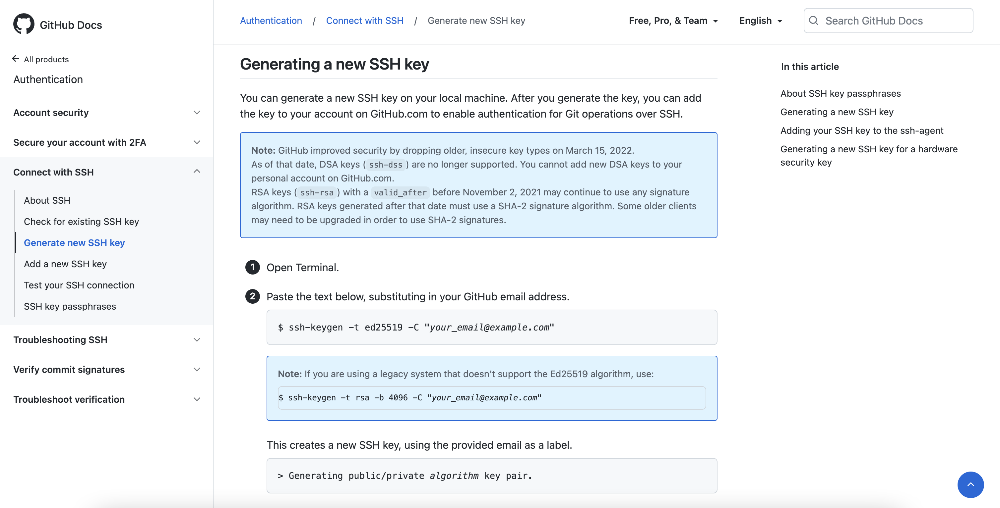
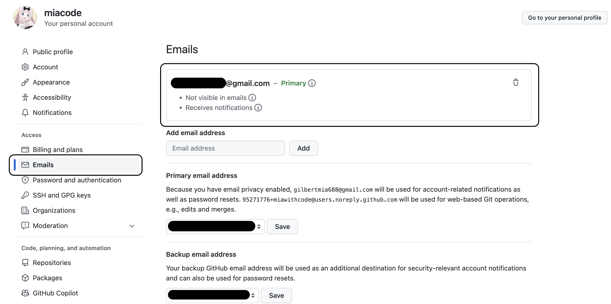
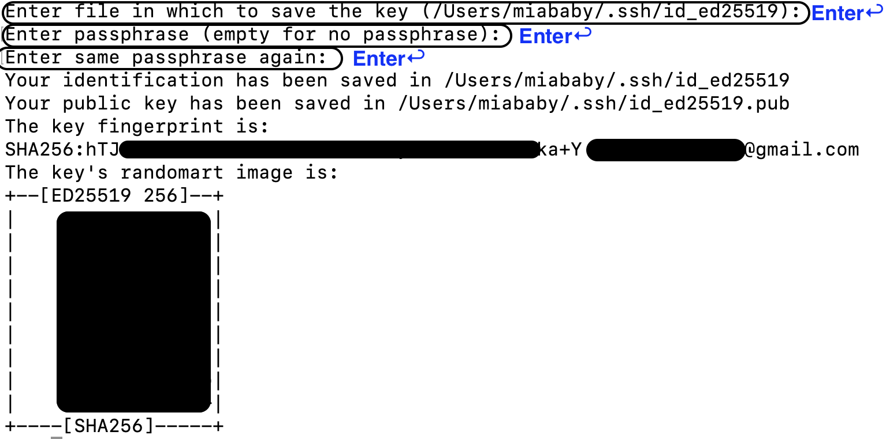
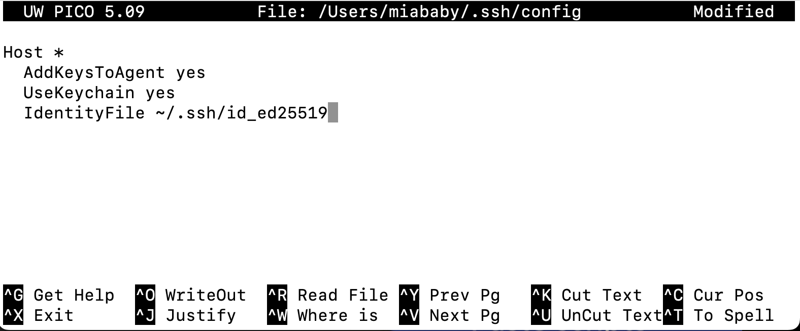
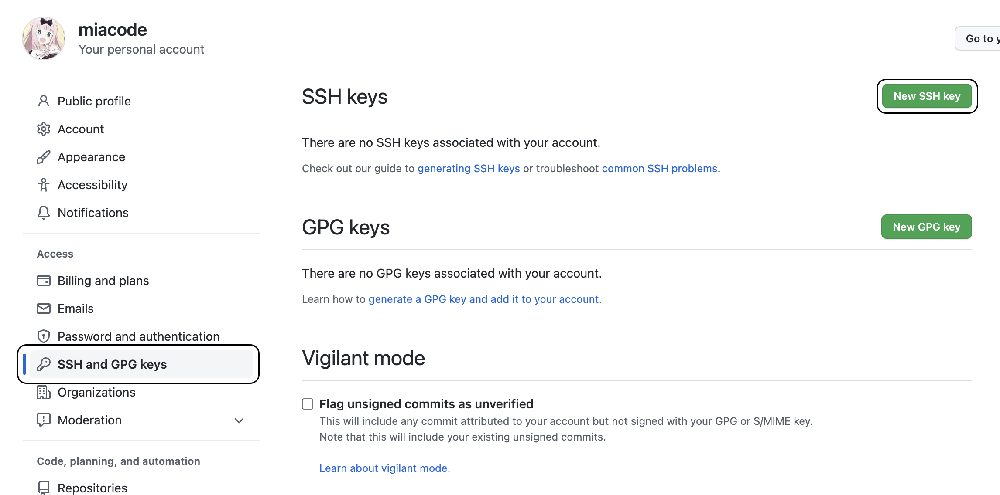
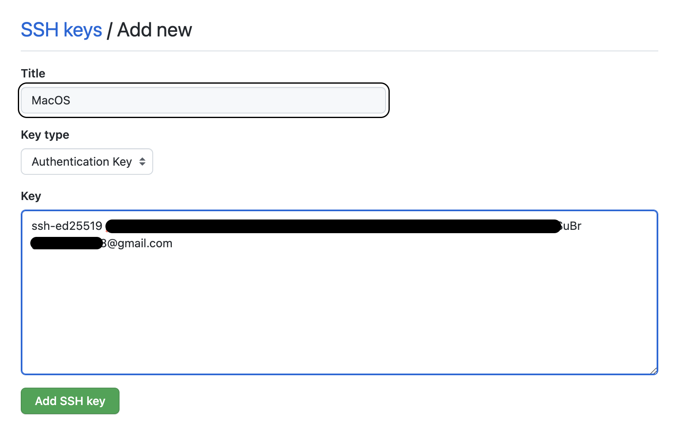
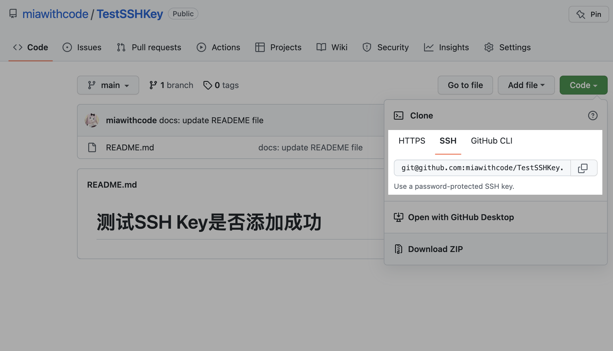

SSH(Secure Shell)是允许两台电脑之间通过安全连接进行数据交换的网络协议。

在本地电脑生成SSH Key私钥，再将SSH Key公钥添加到GitHub，就实现了本地电脑和GitHub服务器安全连接，可以把本地仓库推送到GitHub远程仓库，或把GitHub远程仓库拉取到本地仓库，即两台电脑间的数据交换。

**Noted**：GitHub在2022年5月添加了SSH安全性，以往添加SSH Key的教程在有些细节处可能不适用，这是2022年下半年添加SSH Key的教程。

## 生成SSH Key

1. 点开[GitHub](https://github.com/)账号头像下的 `Settings`
    

2. 找到 `Settings` 下的 `SSH and GPG keys`，点击 `generating SSH keys`，点击后会打开一个新的页面。
    

3. 在新的页面中选择 `Generating a new SSH key and adding it to the ssh-agent`
    

4. 注意选择对应操作系统的教程。
    

5. 往下滑动页面会看到GitHub给出的Mac下生成SSH Key的指南，按照指南的步骤一步一步进行。
    

6. 打开终端（Terminal），复制粘贴以下文本到终端，把 `your_email@example.com` 替换成你注册GitHub时使用的邮箱，然后按下Enter键。
    ```shell
	ssh-keygen -t ed25519 -C "your_email@example.com"
    ```
    
- 如果你不记得注册GitHub时使用的邮箱，可以从 `Settings` 中的 `Emails` 中查看。
	

7. 出现 `Enter file in which to save the key(...)` ，按下 `Enter`键，一直按 `Enter` 直到出现以下画面。
    

8. 🎉 恭喜你的SSH Key已经生成成功，接下来把生成的SSH Key添加到ssh-agent。

---
## 添加SSH Key到ssh-agent

1. 在终端（Terminal）中输入命令：
    ```shell
	eval "$(ssh-agent -s)"
    ```
- 命令执行后终端会给出**Agent pid**
    

2. 如果你使用的是[**macOS Siera 10.12.2或以上的版本**](https://docs.github.com/cn/authentication/connecting-to-github-with-ssh/generating-a-new-ssh-key-and-adding-it-to-the-ssh-agent#adding-your-ssh-key-to-the-ssh-agent)，你需要修改 `~/.ssh/config` 文件来自动加载密钥到ssh-agent 和储存passphrases到你的钥匙链。
    - 首先，检查电脑中是否存在 `~/.ssh/config` 文件
    ```shell
	open ~/.ssh/config
    ```
    - 如果像我一样显示这个config文件不存在，则创建这个文件
        
    ```shell
	touch ~/.ssh/config	
    ```
    - 用编辑器打开 `~/.ssh/config` 文件
	```shell
	nano ~/.ssh/config 
    ```
    - 在nano窗口中复制粘贴以下代码：
    ```
	Host *
		AddKeysToAgent yes
		UseKeychain yes
		IdentityFile ~/.ssh/id_ed25519
    ```
    - 粘贴代码后按  `control+X` 退出编辑器
        

    - 输入 `y` 保存更改 
        

    - 出现这个画面后再按 `Enter` 键  
        

3. 将 SSH Key 添加到ssh-agent。如果你使用的是[**Mac Monterey(12.0)及以上版本**](https://docs.github.com/cn/authentication/connecting-to-github-with-ssh/generating-a-new-ssh-key-and-adding-it-to-the-ssh-agent#adding-your-ssh-key-to-the-ssh-agent)，请使用以下命令（~~因为在Mac Monterey(12.0)及以上版本中，`-K` 标志已经被废弃，被 `--apple-use-keychain` 代替~~）。
    ```shell
    ssh-add --apple-use-keychain ~/.ssh/id_ed25519
    ```
    - 如果不是Mac Monterey(12.0)及以上版本，使用以下命令：
    ```shell
    ssh-add -K ~/.ssh/id_ed25519
    ```

- 🎉 出现 `Identity added` 即表示添加成功。
    

---
## 添加SSH Key到GitHub

1. 在终端输入以下命令， `pbcopy` 会复制SSH Key内容到剪贴板
    ```shell
	pbcopy < ~/.ssh/id_ed25519.pub
    ```
2. 再次打开GitHub `Settings` 下的 `SSH and GPG Key` ，点击 `New SSH key`
    
3. 添加本机生成的SSH Key到GitHub：
    - 在**Title**中给这个SSH Key命名
    - **Key Type**选择 `Authentication Key` 
    - 在**Key**中 `Command+V` 粘贴刚刚复制的SSH Key
    - 添加后点击 `Add SSH Key` 。
    
4. 🎉 添加完成。

---
## 测试SSH Key是否添加成功

1. 选择一个要用SSH Key clone的仓库，复制这个仓库的SSH链接。
    
2. 在终端输入:
    ```shell
	git clone [ssh-url]
    ```
    
3. 🎉 clone成功即代表SSH Key添加成功。

---
## Reference
- [How to Set Up an SSH Key to GitHub on Mac](https://www.youtube.com/watch?v=_RsP81Et12s)