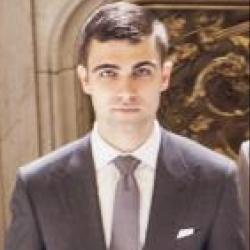
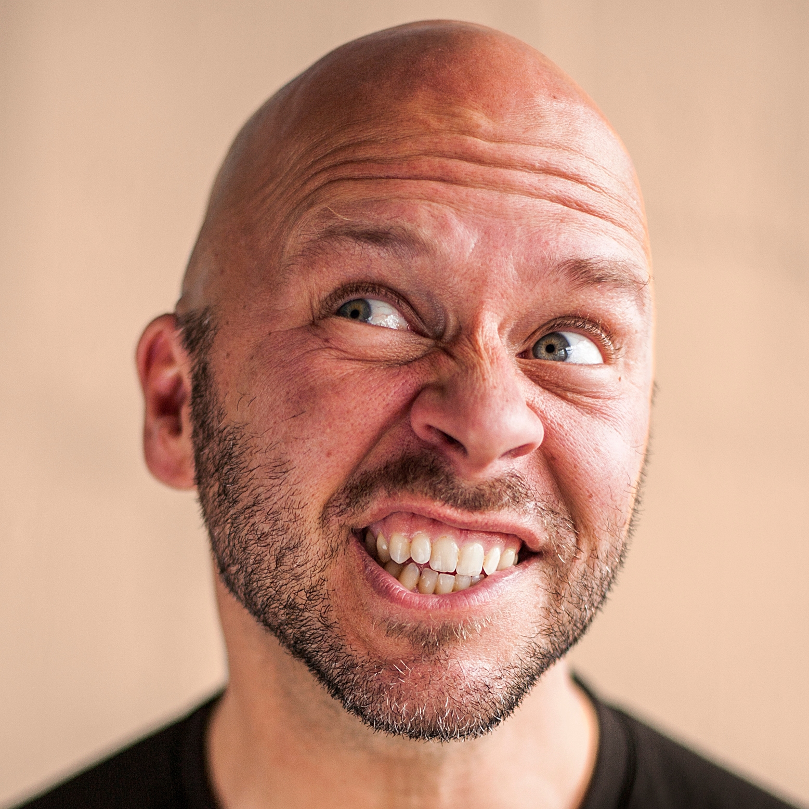
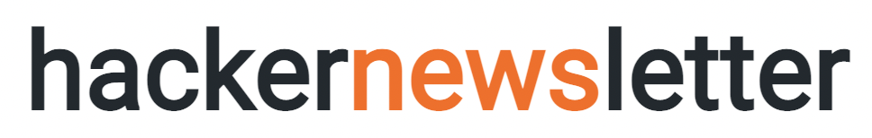
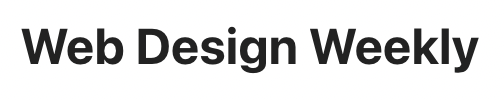
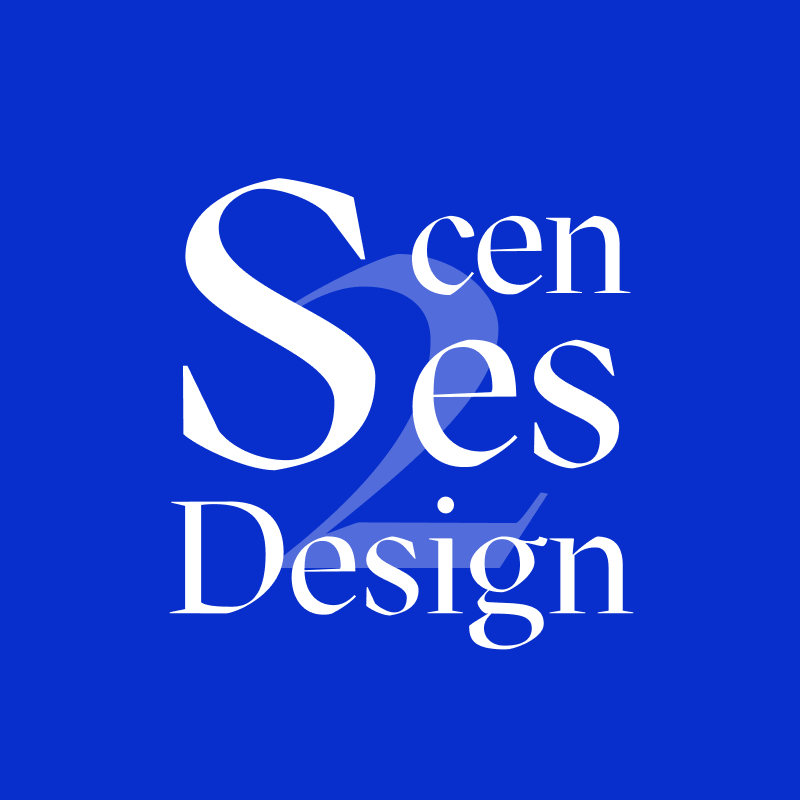
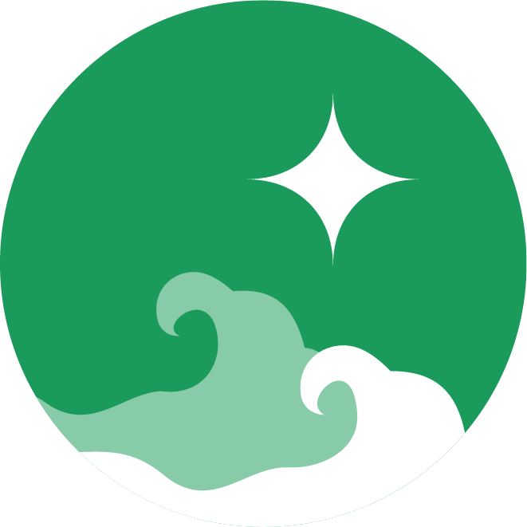
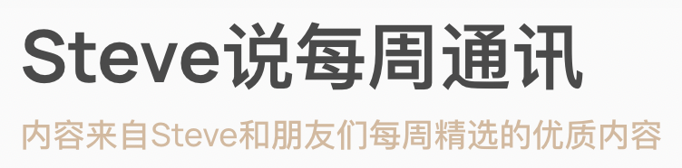

## Blog

<table>
    <thead>
        <tr>
            <th>Logo</th>
            <th>Title</th>
            <th>Description</th>
            <th>Tag</th>
        </tr>
    </thead>
    <tbody>
         <tr>
            <td></td>
            <td><a target="_blank" href="https://babich.biz/">Nick Babich</a></td>
            <td>产品设计师写的 ui/ux 内容</td>
            <td>#ui/ux #设计</td>
        </tr>
        <tr>
            <td></td>
            <td><a target="_blank" href="https://sive.rs/">Derek Sivers</a></td>
            <td></td>
            <td>#写作 #生活</td>
        </tr>
    </tbody>
</table>

---
## Newsletter

<table>
    <thead>
        <tr>
            <th>Logo</th>
            <th>Title</th>
            <th>Description</th>
            <th>Tag</th>
        </tr>
    </thead>
    <tbody>
        <tr>
            <td></td>
            <td><a target="_blank" href="https://hackernewsletter.com/">Hacker Newsletter</a></td>
            <td>汇集关于技术、编程、创业的文章，了解新技术和这个产业正在发生什么</td>
            <td>#编程 #技术</td>
        </tr>
         <tr>
            <td></td>
            <td><a target="_blank" href="https://css-weekly.com/">CSS Weekly</a></td>
            <td>CSS 文章、教程、工具</td>
            <td>#前端 #css</td>
        </tr>
        <tr>
            <td></td>
            <td><a target="_blank" href="https://javascriptweekly.com/">Javascript Weekly</a></td>
            <td>JavaScript 文章、新闻、项目</td>
            <td>#前端 #javascript</td>
        </tr>
        <tr>
            <td></td>
            <td><a target="_blank" href="https://web-design-weekly.com/">Web Design Weekly</a></td>
            <td>最新网页设计和前端的趋势</td>
            <td>#前端 #设计</td>
        </tr>
         <tr>
            <td></td>
            <td><a target="_blank" href="https://uxpsychology.substack.com/">UX Psychology</a></td>
            <td>与用户体验有关的各种问题</td>
            <td>#ui/ux #设计</td>
        </tr>
        <tr>
            <td></td>
            <td><a target="_blank" href="https://designscenes.zhubai.love/">Design Scenes Weekly</a></td>
            <td>设计视角下的互联网资讯观察与节选</td>
            <td>#设计</td>
        </tr>
        <tr>
            <td></td>
            <td><a target="_blank" href="https://hsxg.zhubai.love/">海上星光</a></td>
            <td>汇集最新的科技产品的更新动态</td>
            <td>#科技 #设计</td>
        </tr>
        <tr>
            <td></td>
            <td><a target="_blank" href="https://aliabdaal.com/newsletter/">Sunday Snippets</a></td>
            <td>Ali Abdaal 的 Newsletter， 分享生产力的见解和技巧</td>
            <td>#生产力 #创作</td>
        </tr>
        <tr>
            <td></td>
            <td><a target="_blank" href="https://www.getrevue.co/profile/thinkingjimmyT">随意搜寻</a></td>
            <td>记录过去一周，搜寻到的令我有所感悟的信息</td>
            <td>#杂</td>
        </tr>
        <tr>
            <td></td>
            <td><a target="_blank" href="https://via.zhubai.love/">事不过三</a></td>
            <td>重要的事情不过三件：认识自己、好好学习、好好生活</td>
            <td>#杂</td>
        </tr>
        <tr>
            <td></td>
            <td><a target="_blank" href="https://steve.hedwig.pub/">Steve说每周通讯</a></td>
            <td>内容来自Steve和朋友们每周精选的优质内容</td>
            <td>#杂</td>
        </tr>
    </tbody>
</table>